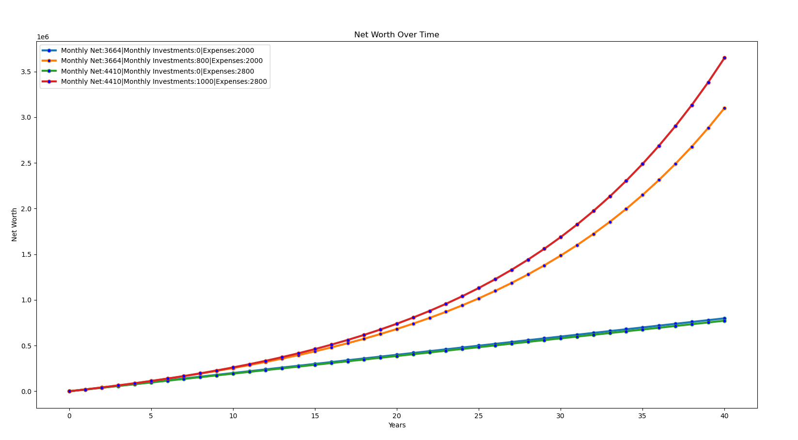

# Line Graph of Net Worth Over Time

## Important Notes
* This is just a simple line graph which was created using the Matplotlib library
* This just paints a simple picture. There are of course other factors to someones net worth over time such as: different investment returns, increasing/decreasing income over time, large purchases, home equity

# What is this:
This is a simple script that calculates a persons net worth over time in 1 year intervals. 

## How it works:
1. First it creates a person object based on some passed in arguments:
```
person1 = Person(0,0,3664,500,2000) # 65k after tax GA - investing 0 a month
```
* argument 1: starting cash | (0 in the example above)
* argument 2: starting investments | (0 in the example above)
* argument 3: monthly net income after taxes | (3664 a month in the example above - or 65k a year)
* argument 4: monthly invesments (it assumes only an 8% return every year) | (500 a month in the example above)
* argument 5: monthly expenses | (2000 a month in the example above)<br><br>

2. For each person it calculates thier data and plots it on a graph. You can see in this code snippet, the number of years calculated is 30:
```
for person in peoplelist:
        (xlist,ylist) = getplotvals(person,30)
        makeplots(person,xlist,ylist)
```

## Example:
#### Create 4 Person() objects:
```
person1 = Person(0,0,3664,0,2000) # 65k after tax GA - investing 0 a month
person2 = Person(0,0,3664,800,2000) # 65k after tax GA - investing 800 a month
person3 = Person(0,0,4410,0,2800) # 80k after tax ga - investing 0 a month
person4 = Person(0,0,4410,1000,2800) # 80k after tax ga - investing 1000 a month
peoplelist = [person1,person2,person3,person4]
```
#### Set years:
```
    for person in peoplelist:
        (xlist,ylist) = getplotvals(person,40)
        makeplots(person,xlist,ylist)
```
#### Get data:
* Result:
* 
* Someone making 65k a year with expenses around 2k a month (roomating) while only saving money will retire broke
* Someone making 80k a year with expenses around 2.8k a month (1 bedroom apt) while only saving money will retire broke
* Someone making 65k a year with expenses around 2k a month (roomating) while investing and getting 8% a year returns will retire with around 3.2 millon
* Someone making 80k a year with expenses around 2.8k a month (1 bedroom apt) while investing and getting 8% a year returns will retire with around 3.6 millon
# How to use this:
```
python networthgraph.py
```

# Some of the related Python Documentation:
* Matplotlib:  https://matplotlib.org/stable/api/_as_gen/matplotlib.pyplot.html